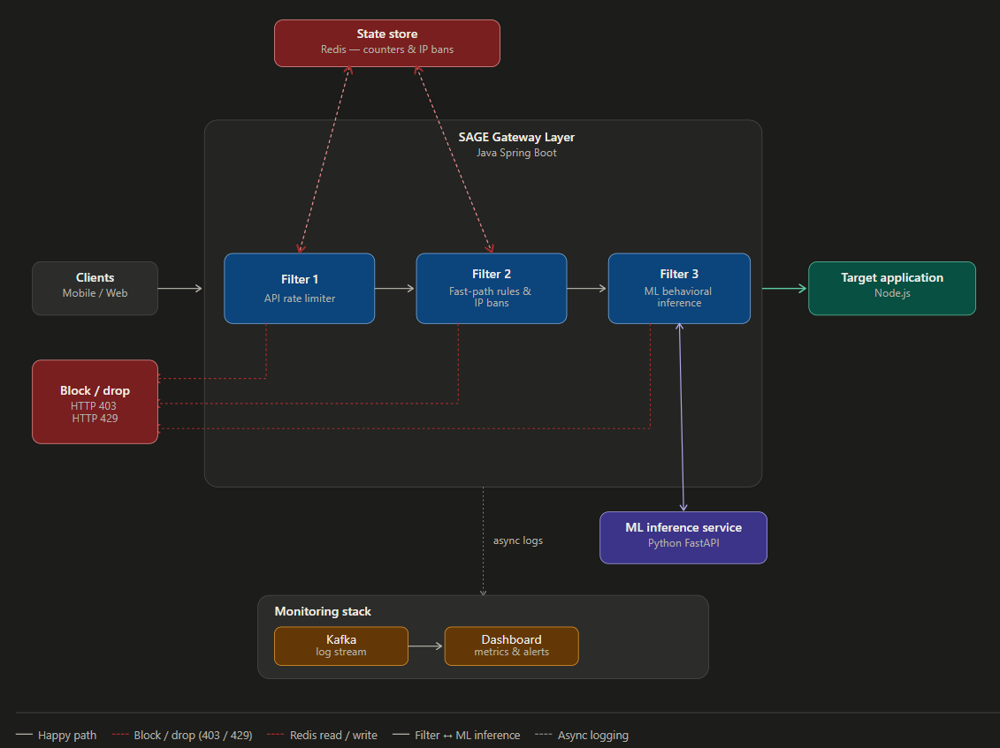
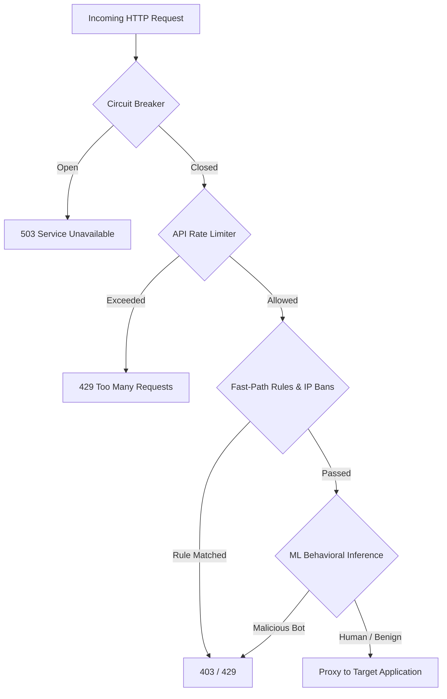
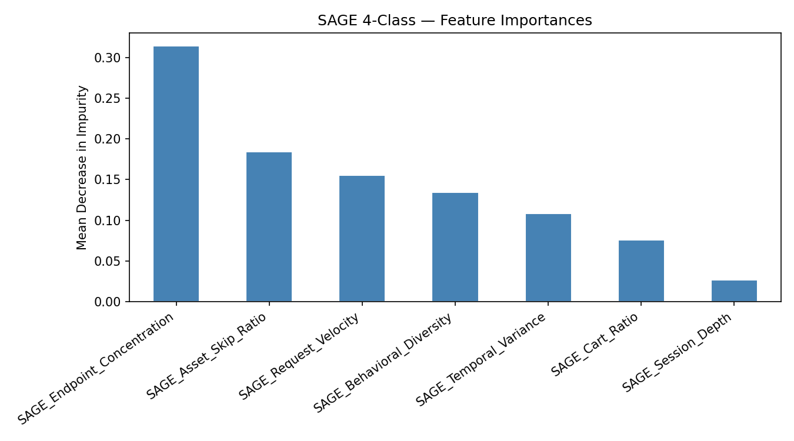

# SAGE: Real-Time Bot Detection and Mitigation Engine

SAGE is a layered security engine designed to detect and mitigate bot attacks against web applications. Rather than relying on a single silver bullet, SAGE employs a defense-in-depth strategy combining traditional infrastructure protections with advanced behavioral machine learning.

## Overview

Malicious bots are a growing threat responsible for credential stuffing, content scraping, inventory scalping, and application-layer DDoS attacks. SAGE is designed for high-throughput traffic using Java 21 Virtual Threads, routing traffic through progressive mitigation layers—from circuit breakers and fast-path rules to a backend ML inference service—blocking malicious requests with sub-10ms latency.

## Key Features

-   **Layered Defense System**: Implements a progressive mitigation pipeline including Circuit Breakers, API Rate Limiting, Fast-Path Rule Bans, and an ML Model check.
-   **High-Performance Reverse Proxy**: Built on a scalable, non-blocking architecture (Java 21 Virtual Threads) to handle high-throughput traffic with minimal latency.
-   **Fast-Path Rule Bans**: Instantly drops traffic from known bad IPs or obvious volumetric floods before hitting expensive downstream components.
-   **ML-Powered Behavioral Analysis**: A decoupled inference service that evaluates behavioral aggregates to detect complex bots (recon, scraped, evaded floods) that bypass basic rate limiters.
-   **Live Monitoring Dashboard**: A dedicated React interface to visualize live traffic, monitor security events, and observe system health.

## Architecture



SAGE operates as a multi-component, orchestrated system designed for high availability and performance.

1.  **`sage-gateway` (Spring Boot)**: The entry point for all traffic. This high-performance reverse proxy intercepts requests, enforces rate limits and fast-path rules, extracts key metadata, and forwards it to the ML inference service for deeper analysis.
2.  **`ml_pipeline` (Python/FastAPI)**: A high-performance inference service exposing a REST API. It receives telemetry from the gateway and uses a pre-trained 4-class Random Forest model to classify complex traffic (Human, Flood, Scraper, Recon).
3.  **`sage-dashboard` (React)**: A single-page application that provides a live dashboard for monitoring traffic, viewing security events, and configuring the gateway. It communicates with the gateway via a WebSocket bridge.
4.  **`mock-target-site` (Node.js/Express)**: A simple web application that serves as a backend for the gateway, allowing for safe testing and demonstration of SAGE's capabilities.
5.  **Monitoring Stack (Prometheus & Grafana)**: A pre-configured monitoring stack scrapes metrics from the gateway and other services to provide insights into system health and performance.

## Tech Stack

-   **Backend**: Java, Spring Boot
-   **Machine Learning**: Python, Scikit-learn, FastAPI, Pandas
-   **Frontend**: JavaScript, React, Vite, Tailwind CSS
-   **Infrastructure**: Docker, Docker Compose, Kafka, Redis
-   **Monitoring**: Prometheus, Grafana
-   **Load Testing**: Locust

## How It Works



## Key Engineering Highlights

-   **Defense-in-Depth Pipeline**: Reduces ML inference overhead by filtering out early volumetric bot traffic using Redis-backed rate limiters and fast-path heuristics before the request ever reaches the ML service.
-   **High Concurrency**: Built on Spring Boot with Java 21 Virtual Threads, enabling high concurrency for synchronous ML inference calls without thread pool exhaustion.
-   **Decoupled ML Inference**: The ML inference service is decoupled from the gateway, allowing it to be scaled independently and updated without service interruption.
-   **Distributed Tracing**: Automatically generates and injects `X-Request-Id` headers across the gateway, ML inference layer, and upstream proxy, enabling seamless end-to-end request tracing and debugging.
-   **Durable Audit Logging**: Implements persistent rolling logs (`logs/traffic.log`) that record comprehensive traffic metrics and telemetry decisions for forensic analysis and compliance.

## Setup and Run

The entire SAGE platform can be run locally using Docker Compose.

**Prerequisites**: Docker, Docker Compose, Java 21, Python 3.10+

1.  Navigate to the `infra` directory:
    ```bash
    cd infra
    ```
2.  Start all services in detached mode:
    ```bash
    docker-compose up -d
    ```

-   **SAGE Gateway**: `http://localhost:8083`
-   **SAGE Dashboard**: `http://localhost:5173`
-   **Grafana Dashboard**: `http://localhost:5050`

After startup, verify the gateway is healthy:
```bash
curl http://localhost:8083/actuator/health
```

## System Performance

### Gateway Metrics
| Metric | Value |
|---|---|
| Throughput | 500+ req/s |
| End-to-End Latency (p99) | 62 ms |
| Rate Limiter | Redis-backed Token Bucket algorithm implemented via an atomic Lua script |

### Model Performance
| Metric | Value |
|---|---|
| Cross-validated Macro F1 (5-fold) | 0.8687 |
| Holdout Macro F1 | 0.7532 |
| Production F1 (Macro Avg) | 94.21% |
| Zero-day detection (unseen bot class) | 100% |
| Human false positive rate | <1% |

**On overfitting:** Initial training showed a 0.22 train-validation gap (train F1=1.0, val F1=0.78). Diagnosed via learning curve analysis and resolved by constraining the Random Forest (max_depth=10, min_samples_leaf=10), which improved CV F1 from 0.80 to 0.87.

### Feature Importance



## Adversarial Validation

To stress-test the robustness of the 7-feature behavioral model, we engineered an active evasion test using Locust. Two adversarial personas were created specifically to spoof the model's highest-weighted features:
1. **SlowFlood**: A bot that targets a single endpoint but adds human-like latency (0.5–1.5s jitter) to bypass `Request_Velocity` detection.
2. **AdversarialScraper**: An ultra-stealthy scraper that rotates real browser User-Agents, waits 1–4 seconds between clicks, and intentionally downloads CSS/JS assets to spoof the `Asset_Skip_Ratio` feature.

### Results

**Live system evaluation (full 3-tier pipeline with Locust, 10-min mixed load test, 109 concurrent users):**
```text
=== LIVE DETECTION RATES ===
SlowFlood            -> Blocked: 7,088/7,244  (97.85%)
AdversarialScraper   -> Blocked: 2,564/4,077  (62.89%)
AkamaiScraper        -> Blocked: 33,375/33,375 (100.00%)
UnprotectedFlood     -> Blocked: 231,756/231,938 (99.92%)
HumanBrowser         -> False Positives: 0/692 (0.00%)
```

### Honest Findings
- **SlowFlood Defeated**: The model successfully caught 97.85% of throttled flood attacks. By relying on multidimensional features rather than just velocity, the `Endpoint_Concentration` signal correctly flagged the bot even when it slowed down to human speeds.
- **AdversarialScraper — From 4.8% to 62.89%**: The standalone ML model only caught 4.8% of the adversarial scraper in offline evaluation. However, the live 3-tier pipeline (rule-based fast-paths + ML + token bucket rate limiter) boosted the effective block rate to **62.89%**. 

## Known Limitations and Countermeasures

SAGE effectively detects tool-based bots (HTTP libraries, CLI tools, basic scripted browsers) using session-level behavioral metrics. However, advanced evasion techniques reveal the boundaries of aggregate behavioral detection:

- **Stealth Browser-Based Scrapers (e.g., Puppeteer, Playwright)**: SAGE currently struggles to detect highly advanced headful/headless browser scrapers that fully render pages, load assets, and mimic human pacing. At the aggregate feature level (Asset_Skip_Ratio, Request_Velocity), these bots are virtually indistinguishable from legitimate users.
- **Countermeasures for Advanced Bots**: Detecting these sophisticated scrapers requires additional detection signals beyond aggregate behavioral metrics, which are out of scope for the current iteration of SAGE. Future enhancements would require:
  - **TLS Fingerprinting (JA3/JA4)**: To identify mismatches between the declared User-Agent and the actual underlying cryptographic stack.
  - **JavaScript Challenges / Proof of Work**: To force the client to execute complex JS, verifying browser environment authenticity.
  - **Client-Side Behavioral Biometrics**: Injecting payloads to analyze mouse movements, scroll depth, and keystroke dynamics.
  - **Session Sequence Modeling**: Implementing LSTMs or Transformers to evaluate the specific *order* of page visits rather than just aggregate metrics (e.g., humans traverse `product → cart → checkout`; bots often loop `product → product → product`).
